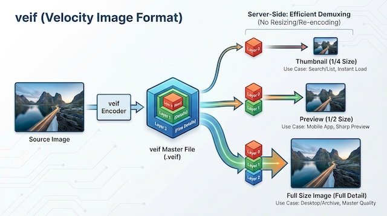
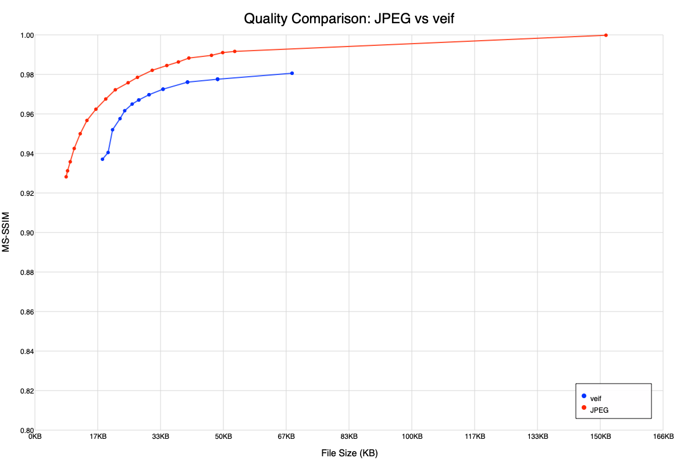
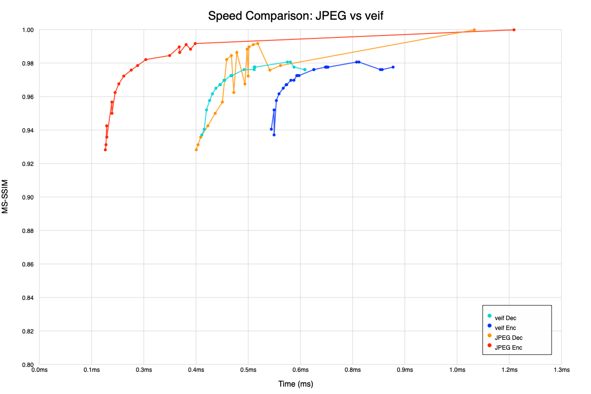
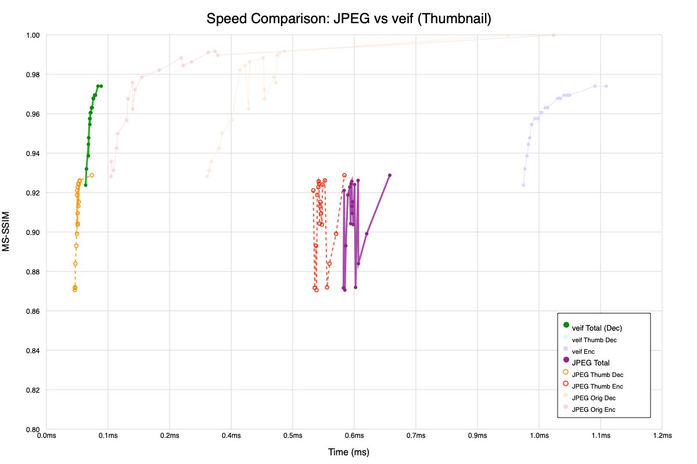
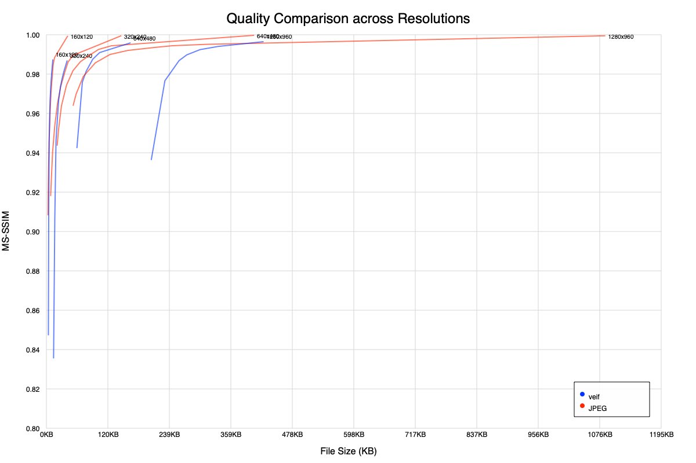

# veif

**veif** is a pragmatic, high-performance image format designed for efficient multi-resolution delivery.

The core philosophy of **veif** is speed and efficiency—not just in compression, but in distribution.

## Motivation

In modern web services and applications, handling user-uploaded images typically requires generating multiple static files for different display sizes (e.g., `original.jpg`, `large.jpg`, `medium.jpg`, `thumbnail.jpg`).

This traditional approach has significant drawbacks:
1.  **Storage Redundancy**: Storing multiple versions of the same image wastes disk space.
2.  **Computational Cost**: The server must decode, resize, and re-encode the source image multiple times to generate these variants.
3.  **Management Complexity**: Managing multiple file artifacts for a single logical image increases system complexity.

## The Solution: One Master File, Multiple Resolutions

**veif** solves this by adopting a multi-resolution architecture, optimized for high-speed processing.



With **veif**, you generate **one single master file**. The server stores only this file.
When a client needs a specific resolution, the server (or the application logic) simply extracts the necessary data layers from the master file.

*   Need a **Thumbnail**? -> Extract **Layer 0** only.
*   Need a **Preview**? -> Extract **Layer 0 + Layer 1**.
*   Need **Full Detail**? -> Extract **All Layers**.
*   Need **Speed**? -> Use **One** mode (Single layer, no progressive structure).

This approach eliminates the need for server-side resizing or re-compression. The "transcoding" process is replaced by efficient binary slicing (demuxing), drastically reducing server CPU load and storage requirements.

### One Mode

The `One` mode is designed for scenarios where speed is the top priority. Unlike the default multi-resolution format, it stores the image as a single data layer without a progressive structure. This reduces processing overhead for both encoding and decoding while maintaining the same image quality.

# Performance

| Layer         | Resolution | Size | Image |
| :---          | :---       | :--- | :--- |
| Layer0        | 1/4        | 4.74KB |  |
| Layer1        | 1/2        | 11.81KB |  |
| Layer2        | 1          | 28.34KB |  |
| One(no layer) | 1          | 40.44KB |  |
| original      | 1          | 213.68KB |  |

### Quality (Size vs MS-SSIM)


### Speed (Time vs MS-SSIM)


### Thumbnail Speed (Total Time)
**veif (DecOnly)** vs **JPEG (FullDec+Resize+Enc+Dec)**



### Resolution Quality (160p - 1280P)
**JPEG (Red)** vs **veif (Blue)**



## When to use veif? (vs. AVIF / JPEG XL)

While next-generation formats like AVIF or JPEG XL focus on achieving the absolute highest compression ratios, they often come with significant computational complexity.  
**veif** takes a more **pragmatic** approach, optimizing for delivery speed and infrastructural efficiency over extreme compression.

- **Use AVIF or JPEG XL when:**
  - You need maximum compression for archival storage.
  - Saving every single byte of bandwidth is your absolute top priority, and you can afford the high CPU cost (and latency) for encoding and decoding.

- **Use veif when:**
  - You need to serve multiple resolutions (thumbnail, preview, full-size) dynamically and instantly from a single master file.
  - You want to completely eliminate server-side resizing and re-encoding costs (e.g., slicing the binary directly at the CDN edge).
  - You are processing user-uploaded images in real-time and require lightning-fast, highly stable encode/decode speeds comparable to heavily optimized JPEG implementations.

# Usage

```swift
import veif

// 0. Convert YCbCr
let data = try Data(contentsOf: URL(fileURLWithPath: "src.png"))
let ycbcr = try pngToYCbCr(data: data)

// --- Default ---

// 1. Encode (Progressive, default 3-layers)
let encoded = try await encode(img: ycbcr, maxbitrate: 200 * 1000)

// 2. Decode (Extract all layers)
let (layer0, layer1, layer2) = try await decode(r: encoded)

// --- Speed Mode ---

// Encode as single layer
let encodedOne = try await encodeOne(img: ycbcr, maxbitrate: 200 * 1000)

// Decode single layer
let decodedOne = try await decodeOne(r: encodedOne)

// --- Individual Layer Handling ---

// Encode into separate layer data
let (e0, e1, e2) = try await encodeLayers(img: ycbcr, maxbitrate: 200 * 1000)

// Decode by stacking layers
let decodedLayers = try await decodeLayers(data: e0, e1, e2)
```

## Internals

- **Color Space**: YCbCr 4:2:0
- **Transform**: Multi-Resolution Discrete Wavelet Transform (LeGall 5/3) 2-level 2D block transform
  - Macroblock DWT (no block artifacts)
  - 3-Layer Progressive Encoding
    - Layer 0: Thumbnail (Base LL band)
    - Layer 1: Medium Quality (Adds HL, LH, HH of level 1)
    - Layer 2: High Quality (Adds HL, LH, HH of level 0)
- **Quantization**: Sampling-based Rate Control
  - Predicts optimal step size by probing 8 key regions (corners, center, edges) to meet target bitrate
  - **Frequency Weighting**: Applies different quantization steps based on frequency bands (Low: 1x, Mid: 2x, High: 4x) to preserve visual quality
  - **Signed Mapping**: Interleaves positive and negative values into unsigned integers (0, -1, 1, -2, 2...) for efficient variable-length coding
- **Entropy Coding**: Zero-run Rice coding
  - RLE zero-run cap (maxVal=64) for stability
- **Multi-Resolution**: 3-layer structure — Layer0 (1/4) → Layer1 (1/2) → Layer2 (1/1)
- **SIMD Pipeline**:
  - **DWT**: Vertical and horizontal lifting steps are fully vectorized using SIMD instructions (SIMD4/8/16) for LeGall 5/3 transform.
  - **Quantization**: Block-based quantization and dequantization use AVX/NEON for parallel processing.
- **Memory Management**:
  - Unsafe buffer pointers are used throughout the pipeline (ImageReader, DWT, Quantization) to minimize ARC overhead and bounds checking.
  - Object Pooling & Instance Reuse.

## CLI Usage

encode/decode

```bash
$ swift run -c release example -bitrate 100 ./docs/src.png /path/to/output/dir
```

benchmark

```bash
$ swift run -c release example -benchmark ./docs/src.png
```

compare

```bash
$ swift run -c release example -compare ./docs/color.png /path/to/output/dir
```

## License

MIT
